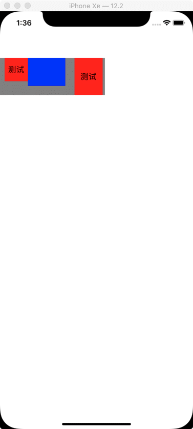

### 基于Autolayout实现了基础的FlexBox布局功能。更加优雅的界面开发方式。

#### 使用方法
```swift
self.view <- [
    UIView(styles: [.position(.absolute), .left(0), .top(100), .background(.gray)]) <- [
        UILabel(styles: [.width(50), .height(50), .top(0),.left(10), .background(.red), .text("测试"), .textAlign(.center)]),
        UIView(styles: [.width(80), .height(60),.right(20), .top(0), .background(.blue)]),
        UILabel(styles: [.width(60), .height(80), .top(0),.right(5), .background(.red), .text("测试"), .textAlign(.center)])
    ]
]
```

### 运行效果



#### 现状与计划
* 目前处于初级孵化阶段，希望有兴趣的朋友可以一起来设计和完善这个项目。
* 计划支持绝大部分css样式。目前只是实现了FlexBox的基础布局功能。样式支持还很弱。
* 为了避免过度的污染原生UIKit，所以是基于iOS的Autolayout来进行实现。可以在项目的任何地方使用这个布局方式。
